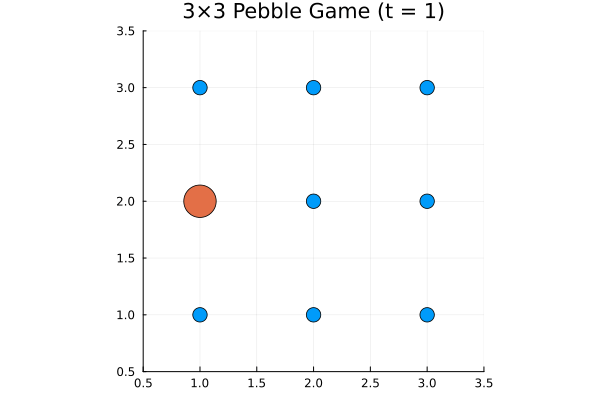

This repository implements Monte Carlo algorithms in statistical mechanics using Python, mainly following
Statistical Mechanics: Algorithms and Computations by Werner Krauth.

References

Statistical Mechanics: Algorithms and Computations — Werner Krauth

Scientific Computing in Python — Abhijit Kar Gupta

Numerical Mathematics and Computing — Ward Cheney and David Kincaid
## 🎞️ Random Walk on a 3*3 lattice

## Velocity Profile of hard disks converges to Maxwell-Boltzmann Distribution

